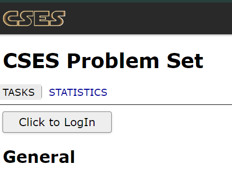
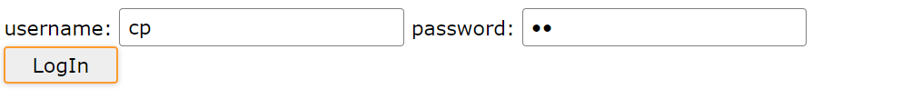
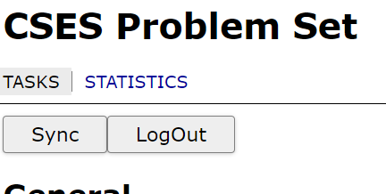
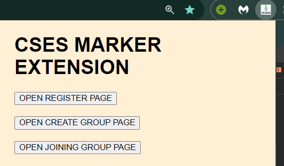

# SORRY FOR LATENCY
I have used render free version so it will take approx 45 sec time to connect for first time.

# CSES-MARKER-CHROME-EXTENSION

This marker allow you to add comment and mark question as important in CSES Platform . People can make groups and can find others comment about that questions and can also see whether their friend mark that question as important or Not.

## Installation

<!-- point wise detailed installation -->

1. Clone the repository
2. Go to chrome://extensions/
3. Turn on developer mode
4. Click on load unpacked and select the dist folder in cloned folder.

## Usage

<!-- How to use the extension -->

1. Go to CSES platform and open CSES problem set.
2. Click on the extension icon and click on open registration page.
3. Register yourself.
4. You can see click to LogIn button in CSES ProblemSet page.
5. Click on it and fill username and password and click on login.
6. Now the button will change to sync and logout.
7. Sync will sync your data with the server so that when you login from other device you can get your data and for safety purpose make sure to sync before logout or closing the browser.
8. Logout will logout you from the extension.
9. you can see a comment in the CSES problem set page for each problem.
10. You can add comment and mark question as important.
11. You can also see other people comment and whether your friend mark that question as important or not only after joining a group.

# Create a group

1. Click on the extension icon and click on open create group page.
2. Fill the group name and group code along with your username and password.
3. Click on create group.

# Join a group

1. Once the group is created you can ask your friend to join the group by giving them the group code and group name.
2. They can join the group by clicking on the extension icon and click on open join group page.
3. Fill the group name and group code along with your username and password.
4. Click on join group.
5. Now you can see other people comment and whether your friend mark that question as important or not.

<!-- adding images -->
<!-- image is not displaying -->

## IMPORTANT

<!-- Important points to be noted -->

1. Make sure to sync before logout or closing the browser.
2. Make sure to sync before login from other device.
3. Make sure to sync on opening the browser so that if any friend of yours mark a question as important or add comment you can see it.
4. NOTE: You can join only one group at a time.So be Cation while joining a group.
5. NOTE: You can't change your username once you register yourself.
6. NOTE: You can't change your group once you join a group.
7. NOTE: You can't change your password once you register yourself.

## DEPENDENCIES

<!-- List of dependencies with version -->

1. manifest_version: 2
2. for storing data I have used IndexedDB and for that I have used leafstore library. src: https://github.com/jindalujjwal0720/leafstore and npm package: https://www.npmjs.com/package/leafstore-db
